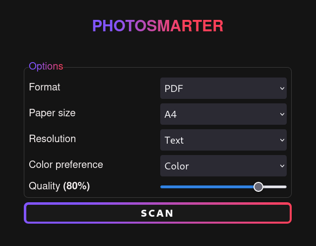

# Photosmarter

This project is a simplified and mobile-friendly web interface for the HP Photosmart scanner. It can be configured to save the scanned photo or document on your **filesystem** or a remote location via **WebDAV** (e.g. Nextcloud).

**Note:** I have only tested it using the HP Photosmart 5520. I cannot guarantee that it works with other Photosmart models.

## Installation

- Rename `.env.example` to `.env` and configure regarding your requirements.
- Run `yarn build`/`npm run build` followed by `yarn start`/`npm run start`.
- Optionally via docker: `docker compose up -d`.

## Credits

Thanks to [pyscanner](https://github.com/amlweems/pyscanner).
I've used their source code for initial directions regarding the communication with the Photosmart scanner.
